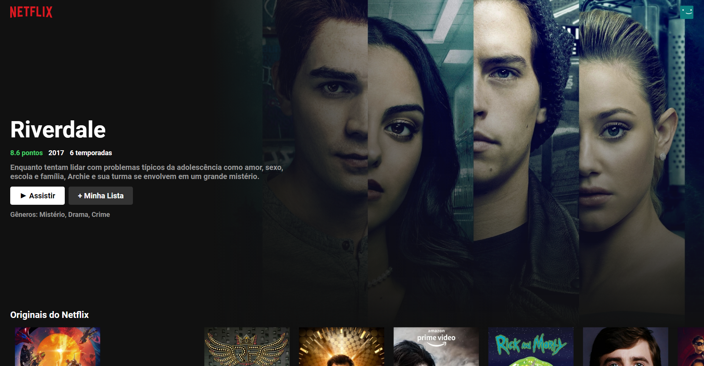
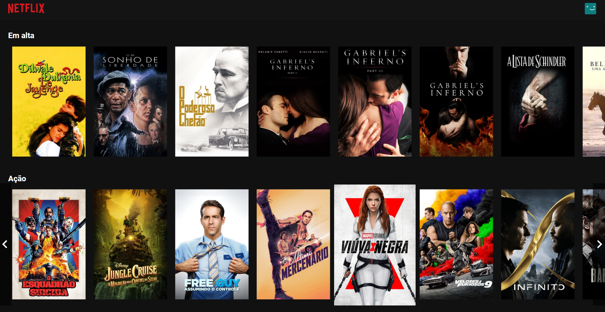

# Clone  em React 

📚 Projeto feito em React para estudo  

👨‍🎓 Nesse projeto eu aprendi: 
  - Manipulação de React 
  - Manipulação do CSS e animações com transições 
  - Manipulação de API webservices  
  - Responsividade em dispositivos Mobile 

## 💻 Começando o projeto

Clone o meu repositório com esse comando:  
- git clone https://github.com/Chaldow/NunesFlix/

Para rodar o projeto, vá no terminal dentro da IDE e execute o comando:
- npm start

Feito com 💚 por Guilherme Nunes  
